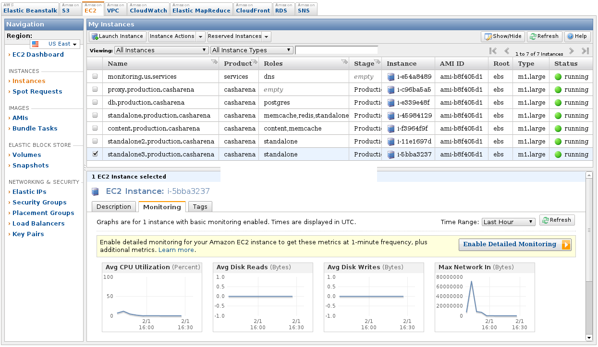
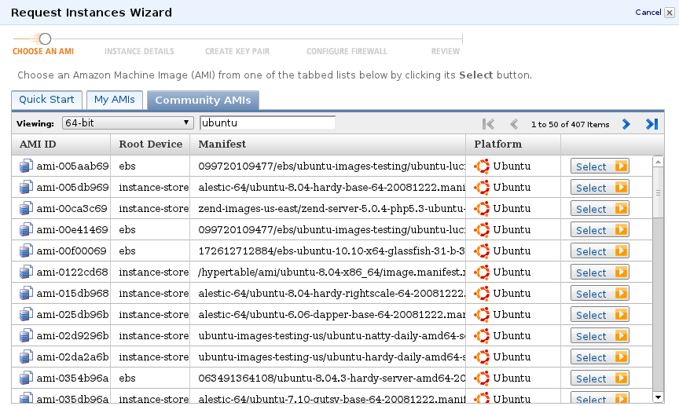
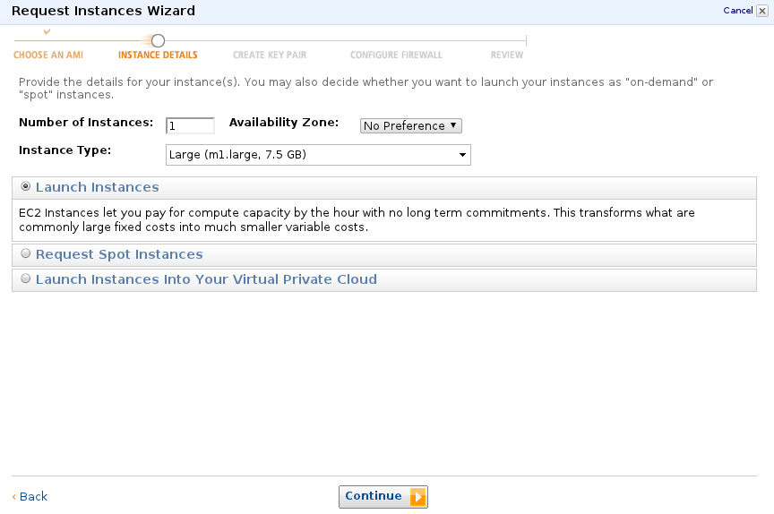
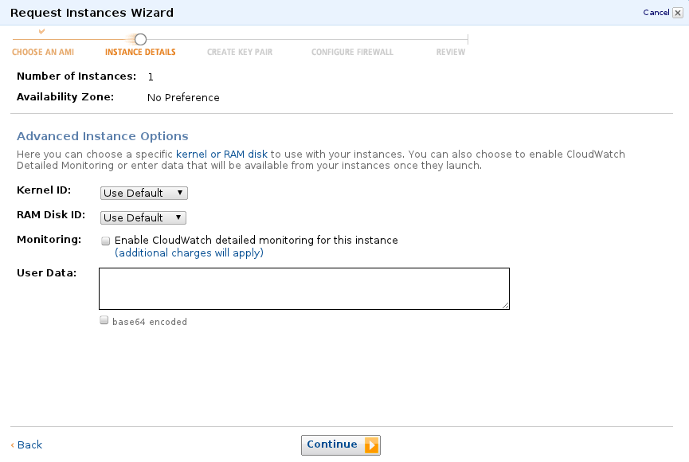
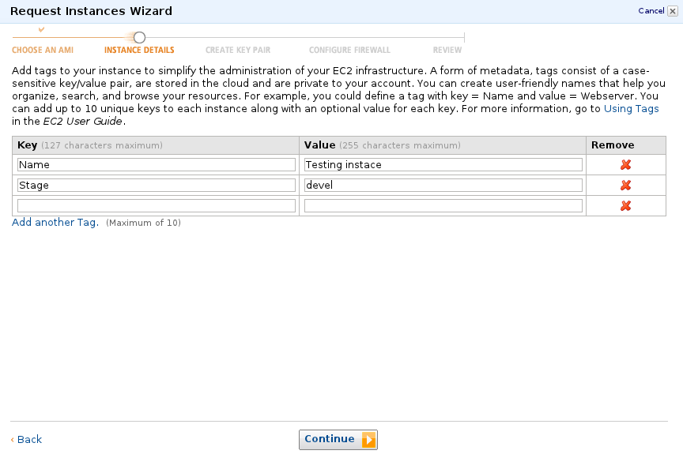
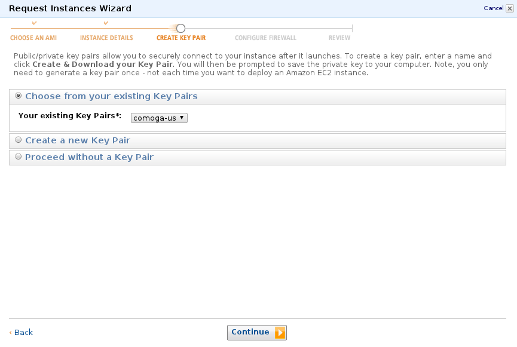
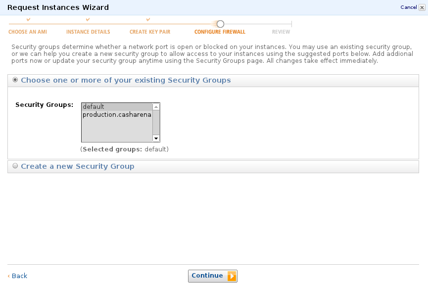
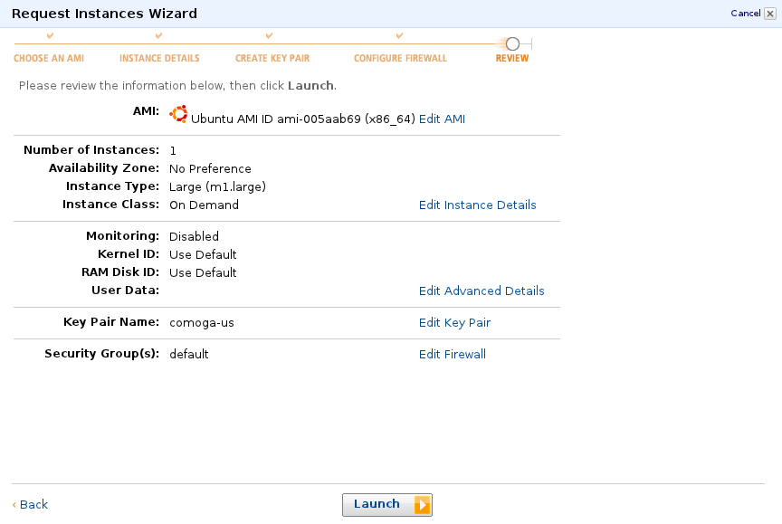
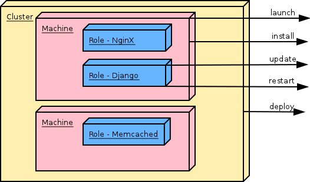

Amazon Web Services (AWS)
=========================

Elastic Cloud (EC2)
-------------------

Jiri Barton, Ales Zoulek

AWS Overview
============

* Elastic Cloud (EC2)
* S3
* CloudFront
* Virtual Private Cloud (VPC)
* Simple Email Service  (SES)
* ...

AWS Console UI
==============

* Amazon account

EC2 Instance
============

* AMI: EBS or local storage

EC2 Instance
============

* hardware
* performance

EC2 Instance
============

* CloudWatch

EC2 Instance
============

* Tags

EC2 Instance
============

* SSH Keys, AWS Keys

EC2 Instance
============

* Security Group

EC2 Instance
============

EC2 Overview
============

* regional
* AMI
* CPU, HDD, network, DNS, SSH

Automated deployment
====================

* fabric
 - python ssh wrapper
 - deployment tool
* boto
 - AWS rest API wrapper
* knitting
 - fabric + boto + magic

Knitting Definitions
====================

Defines:

* Cluster
* Machines
* Roles
* Firewall
* Deployment scenarios

Knitting Architecture
=====================

Knitting Definitions (cluster)
==============================

.. code-block:: python

  definition = {
      'production.mysite': {
          'tags': {
                  'Stage': 'Production',
                  'Product': 'MySite',
              },
          'region': 'eu-west-1',
          'zone': 'eu-west-1a',
          'key_name': 'master_key',
          'credentials_file': os.path.expanduser('~/.ec2/aws.ini'),
          'domain': 'production.mysite',

Knitting Definitions (machines+roles)
=====================================

.. code-block:: python

          'machines': {
              'frontend': {
                  'ami': 'ami-d19ca9a5',
                  'instance': 'm1.large',
                  'security_group': 'webserver',
                  'class': Machine,
                  'roles': {
                      'proxy': Proxy(sites=['nginx/mysite/proxy'],),
                      'django': MySite(),
                  }
              },
              'db': {
                  ...
                  'roles': {
                      'memcache': Memcache(unix_socket=False,),
                      'redis': Redis(),
                      'postgres': BouncedPostgres(
                          db_name='mysite', user='mysite', unix_socket=False, max_db_connections=4096,
                          trust_users=['postgres', 'mysite'], max_bouncer_connections=8192,
                      ),
                  }
              },

Knitting Definitions (scenarios)
================================
.. code-block:: python

    'deploy': [
        'proxy.site_down',
        'ALL.update',
        'django.migrate',
        'django.static',
        'memcache.restart',
        'proxy.site_up',
    ],
    'hotfix': [
        'django.update',
        'proxy.repload',
    ],

Knitting commands
=================

Launch machines::

    fab mysite_production launch

Install machines::

    fab mysite_production install

Run tasks::

    fab mysite_production deploy
    fab mysite_production hotfix

Cons
====

* price
* docs, support
* scalability, EIP, performance

Pros
====

* infrastructure, HW, backup
* API
* additional services

Embrace
=======

* sign up
* embrace
* ???
* profit

