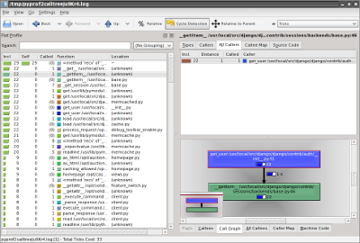

Profiling Django/Python Applications
====================================

http://lurkingideas.net/profiling-django-projects-cachegrind/

It's slow
=========

DEBUG = False
=============

.
=

SQL slow
========

* django-toolbar
* SQL slow log

Code slow
=========

* time.time
    * @, with
    * input: cookie
    * output: headers, pastebin, js.console?

Code slow
=========

.. code-block:: python

    def profile(file=None):

        from hotshot import Profile
        from hotshot.stats import load
        from tempfile import mkstemp
        from os import unlink
        if not file:
            from sys import stdout as file

        def call(func):
            def wrapped(*args, **kwargs):
                filename = mkstemp()[1]

                prof = Profile(filename)
                result = prof.runcall(func, *args, **kwargs)
                prof.close()

                stats = load(filename)
                stats.stream = file
                stats.strip_dirs()
                stats.sort_stats('time', 'calls')

                print >>file, '    Statistics for:', func.__name__
                print >>file
                stats.print_stats()

                unlink(filename)
                return result

            return wrapped

        return call

Code slow
=========

::

  . Statistics for: by_tag

         11002 function calls (10335 primitive calls) in 0.187 CPU seconds

   Ordered by: internal time, call count

   ncalls  tottime  percall  cumtime  percall filename:lineno(function)
       12    0.007    0.001    0.008    0.001 base.py:231(execute)
     12/2    0.005    0.000    0.128    0.064 defaulttags.py:177(render)
     80/1    0.005    0.000    0.137    0.137 base.py:740(render)
  873/865    0.005    0.000    0.007    0.000 encoding.py:54(force_unicode)
    38/30    0.005    0.000    0.027    0.001 importlib.py:18(import_module)
   283/88    0.005    0.000    0.012    0.000 copy.py:144(deepcopy)
  ...

Cachegrind
==========

http://lurkingideas.net/profiling-django-projects-cachegrind/

Cachegrind - middleware
=======================

.. code-block:: python

    from datetime import datetime
    import cProfile

    class InstrumentMiddleware(object):
        def process_request(self, request):
            if 'profile' in request.COOKIES:
                request.profiler = cProfile.Profile()
                request.profiler.enable()

        def process_response(self, request, response):
            if hasattr(request, 'profiler'):
                request.profiler.disable()
                stamp = (request.META['REMOTE_ADDR'], datetime.now())
                request.profiler.dump_stats('/tmp/%s-%s.pro' % stamp)
            return response

Cachegrind - process output
===========================

kcachegrind, pyprof2calltree

::

    pyprof2calltree -i 123.124.125.126-2011-01-19\ 18\:49\:35.134598.pro -k
    .

