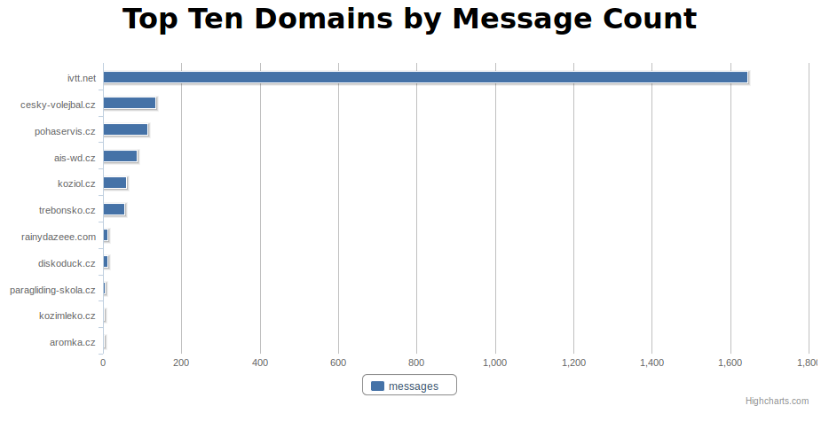

Redis to Find Spammers
======================

2011-08-17 Jiří Bartoň

Problem
=======

::

    Subject:    [Casablanca RT #105973] Email Feedback Report for IP 81.0.217.100
    Date:   Wed, 13 Jul 2011 07:30:32 +0200
    From:   Robert Grohol via Casablanca INT RequestTracker <rt@casablanca.cz>
    Reply-To:   rt@casablanca.cz
    To:     info@tele3.cz
    
    
    Vážený uživateli sítě Casablanca INT,
    
    níže přikládáme stížnost, která nám byla doručena a ve které je 
    uvedeno, že z vám přidělené IP adresy odchází nevyžádaná pošta 
    (tzv. spam). Znamená ...

Infrastructure
==============

RewriteRule ^(.*) /var/www/hosting/${lowercase:%{SERVER_NAME}}$1

Solution
========

* Redis Sorted Sets!
* smtp.www --> domain1.com: 50, domain2.com: 73, etc.
* ZREVRANGE

Apache
======

::

    <Directory /var/www/hosting/adamis.cz>
            php_admin_value sendmail_path "/usr/local/bin/sendmail_log adamis.cz"
    </Directory>
    
    <Directory /var/www/hosting/adoma.cz>
            php_admin_value sendmail_path "/usr/local/bin/sendmail_log adoma.cz"
    </Directory>
    
    <Directory /var/www/hosting/adorah.cz>
            php_admin_value sendmail_path "/usr/local/bin/sendmail_log adorah.cz"
    </Directory>

    ...

Log Message Count
=================

.. code-block:: python

    #!/usr/bin/env python
    
    import redis
    import sys
    import subprocess
    
    subprocess.Popen(['/usr/sbin/sendmail', '-t'])
    
    rd = redis.Redis(host='redis.tele3.cz')
    rd.zincrby('smtp.www', sys.argv[1], 1)

View Spammers
=============

::

    $ redis-cli zrevrange smtp.www 0 10 withscores

    1. "ivtt.net"
    2. "1650"
    3. "cesky-volejbal.cz"
    4. "135"
    5. "pohaservis.cz"
    6. "115"
    7. "ais-wd.cz"
    8. "88"
    ...

redis2-nginx-module
===================

http://wiki.nginx.org/3rdPartyModules

::

    server {
        server_name     smtpstats.tele3.cz;
    
        access_log  /var/log/nginx/smtpstats.access.log;
        root /var/www/smtpstats;
        index index.html;
    
        location /top {
            redis2_query zrevrange smtp.www 0 10 withscores;
            redis2_pass 127.0.0.1:6379;
        }
    }

redis2-nginx-module output
==========================

http://smtpstats.tele3.cz/top

::

    *22
    $8
    ivtt.net
    $4
    1644
    $17
    cesky-volejbal.cz
    $3
    135
    $13
    pohaservis.cz
    $3
    115
    ...

Webpage
=======

http://smtpstats.tele3.cz/top

Statistics per day, etc.
========================

Use redis keys like this:

* smtp.www.2011-08-17
* smtp.www.2011-08-17-20

Webpage Source
==============

.. code-block:: html

    <html>
    <head>
    
    
    
    
    
    </head>
    <body>
    <h1>
Top Ten Domains by Message Count
</h1>
    

    </body>
    </html>

